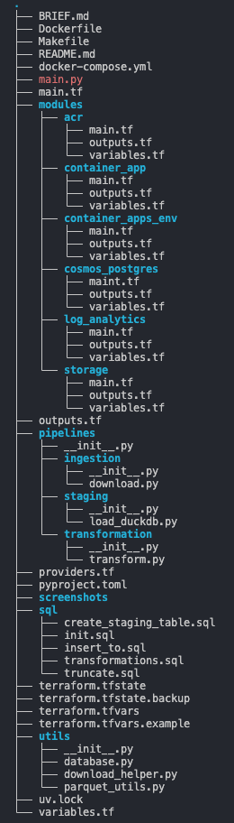
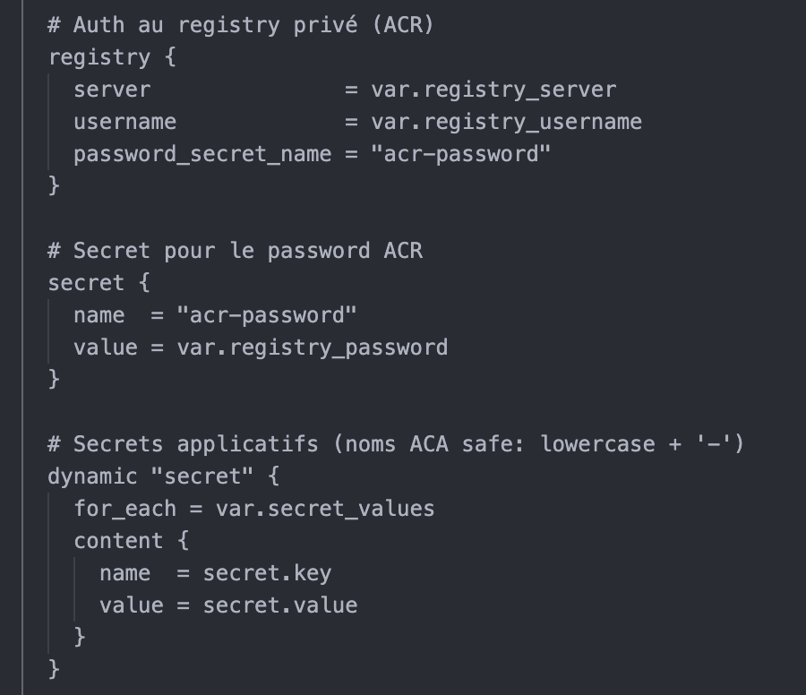
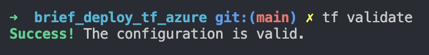
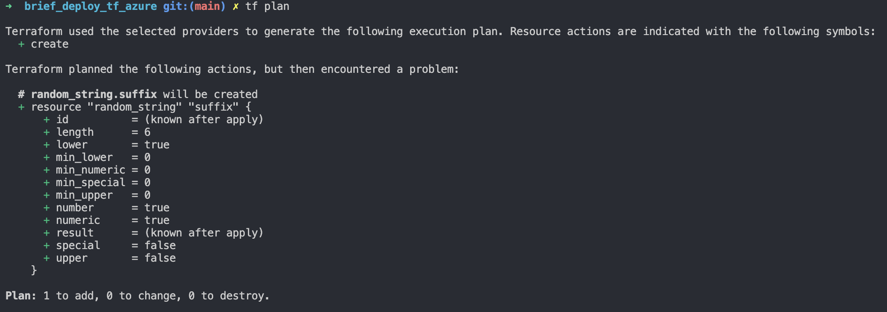

# 🚕 Déploiement d’une Infrastructure Data Engineering sur Azure

## 📌 Présentation du projet

Ce projet a pour objectif de déployer une infrastructure Data Engineering complète sur Microsoft Azure en utilisant Terraform (Infrastructure as Code), Docker et les services managés Azure.

Le cas d’usage repose sur l’analyse des données NYC Taxi & Limousine Commission, afin de fournir un environnement permettant :
- l’ingestion de données brutes,
- leur stockage dans Azure Blob Storage,
- leur transformation via un pipeline containerisé,
- leur chargement dans un data warehouse PostgreSQL (Cosmos DB for PostgreSQL).

L’infrastructure est reproductible, modulaire, et pensée pour le développement / test.

---

## 🏗️ Architecture déployée

```text
Azure Resource Group
│
├── Azure Blob Storage
│   ├── raw/         (données brutes parquet)
│   └── processed/   (données transformées)
│
├── Azure Container Registry (ACR)
│   └── nyc-taxi-pipeline:latest
│
├── Cosmos DB for PostgreSQL (Citus)
│   └── Data Warehouse (star schema)
│
├── Log Analytics Workspace
│   └── Logs applicatifs & métriques
│
└── Azure Container Apps
    └── Pipeline Data Engineering (job-like)
```

---

## 🧰 Technologies utilisées

- Terraform (IaC)
- Azure CLI
- Docker
- Azure Blob Storage
- Azure Container Registry
- Azure Container Apps
- Cosmos DB for PostgreSQL (Citus)
- Log Analytics

---

## ✅ Prérequis

### Outils locaux requis

- Azure CLI
- Terraform >= 1.x
- Docker

### Connexion Azure

```bash
az login
```

Sélection de la souscription :

```bash
az account list -o table
az account set --subscription <SUBSCRIPTION_ID>
```

Export de la souscription pour Terraform :

```bash
export ARM_SUBSCRIPTION_ID="$(az account show --query id -o tsv)"
```

---

## 📁 Structure du projet



---

## ⚙️ Configuration Terraform

Créer un fichier `terraform.tfvars` à partir de l’exemple :

```bash
cp terraform.tfvars.example terraform.tfvars
```

Exemple de variables (sans secrets) :

```hcl
project_name            = "tf_azure"
environment             = "dev"
location                = "francecentral"
resource_group_name     = "totoRG"
postgres_admin_password = "mot de passe"
start_date              = "2023-01"
end_date                = "2023-02"
```

⚠️ Les mots de passe ne doivent jamais être commités. Les accès sensibles (ACR, PostgreSQL, Storage) sont gérés dans le code via des secrets Terraform et injectés de manière sécurisée.



---

## 🐳 Docker & Azure Container Registry

### Connexion à l’ACR

```bash
az acr login --name <ACR_NAME>
```

### Build de l’image

⚠️ Important : build en linux/amd64 (compatibilité Azure)

```bash
docker build --platform linux/amd64 -t nyc-taxi-pipeline:latest .
```

### Tag de l’image

```bash
docker tag nyc-taxi-pipeline:latest <ACR_LOGIN_SERVER>/nyc-taxi-pipeline:latest
```

### Push vers ACR

```bash
docker push <ACR_LOGIN_SERVER>/nyc-taxi-pipeline:latest
```

Vérification :

```bash
az acr repository list --name <ACR_NAME> -o table
az acr repository show-tags --name <ACR_NAME> --repository nyc-taxi-pipeline -o table
```

---

## 🚀 Déploiement Terraform

### Initialisation

```bash
terraform init
```

### Validation

```bash
terraform validate
```



### Plan

```bash
terraform plan
```



### Déploiement

```bash
terraform apply
```

---

## ▶️ Exécution du pipeline

Le Container App fonctionne en mode job-like :
- min replicas = 0
- max replicas = 1

L’exécution démarre automatiquement à la création de la révision.

### Logs

```bash
az containerapp logs show \
  --name <CONTAINER_APP_NAME> \
  --resource-group <RG_NAME> \
  --follow
```

---

## 🗄️ Vérification du stockage

Lister les containers :

```bash
az storage container list \
  --account-name $(terraform output -raw storage_account_name) \
  --auth-mode login \
  -o table
```

---

## 🧠 Accès PostgreSQL

Les informations de connexion sont exposées via les outputs Terraform.

```bash
psql "postgresql://<user>:<password>@<host>:5432/citus?sslmode=require"
```

---

## 🧹 Nettoyage

```bash
terraform destroy
```

⚠️ Recommandé après chaque session pour limiter les coûts.

---

## 🐞 Troubleshooting

### Problème ACR / Image Docker

- Image absente ou mauvais tag → rebuild + push
- Architecture ARM → utiliser `--platform linux/amd64`

### Container App en échec

- Vérifier l’authentification ACR
- Vérifier les secrets et variables d’environnement
- Consulter les logs Log Analytics

### Accès Blob Storage refusé

- Lister via `auth-mode login`
- Rôles requis : `Storage Blob Data Reader`

---

## ℹ️ Note importante

L’infrastructure est fonctionnelle en l'état.

---

## ✅ Conclusion

Ce projet démontre la mise en place complète d’une infrastructure Data Engineering moderne sur Azure, respectant les bonnes pratiques :
- Infrastructure as Code
- Sécurité des secrets
- Conteneurisation
- Observabilité

🚀

